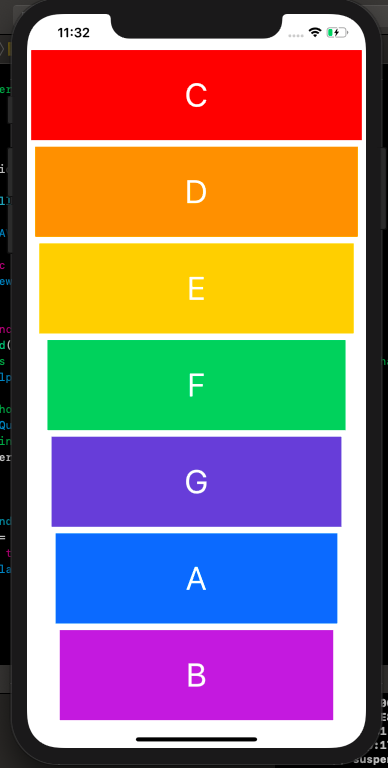

# Xylophone_ios
A simple iOS app which allows you to play the xylophone.

## Screenshots

## Description
It uses the AVFoundation library to play certain sound when a bar of the xylophone is pressed.

## To Run
- Open Xcode Source control and clone repo
- Run on preferred device

## Required
- iOS 13.x
- Xcode 11.x
